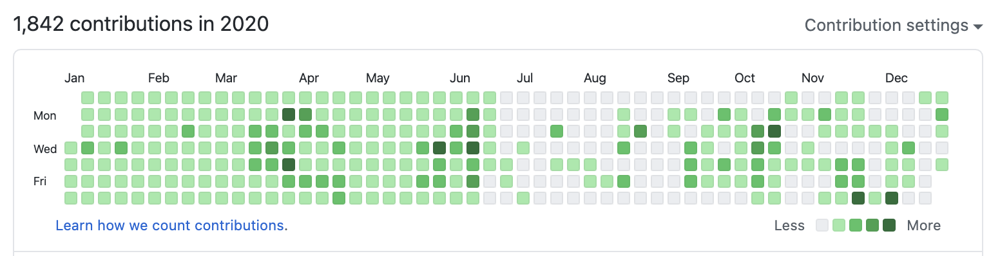
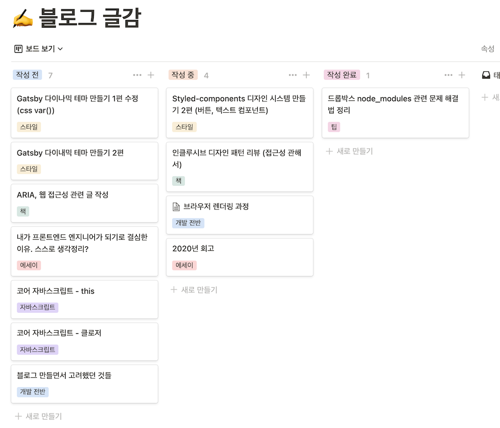

매해 연말마다 늘 느끼지만 시간이 참 빠르다. 한 살 한 살 나이를 먹을수록 시간엔 가속도가 붙는 거 같다. 나이가 들수록 매일 같은 하루가 반복돼서 시간이 빨리 간다고 느낀다고 한다. 그런데 올해는 참 다사다난한 한 해였다. 반복되는 나날들도 많았지만 여러 사건이 더 많았다. 그냥 사람은 뭐든 지나고 나면 금세 잊는 거 같다. 사람은 망각의 동물이라고 하니까. 올해엔 무슨 일들이 있었나 아직 잊지 않은 기억 속을 뒤적여본다.

## 활동

### 코드스쿼드

작년 말, 프론트엔드 개발자가 되기로 마음먹고 코드스쿼드 부트캠프 입학시험을 봤던 기억이 난다. 어떻게 합격이 됐고, 올해 1월부터 코드스쿼드에서 개발을 공부했다. 나는 디자인과 출신이었기에, 주변에 코드에 관해서 이야기할 사람이나 미래에 관해 이야기할 사람이 거의 없었다. 그런데 코드스쿼드에 와선 '나와 같은 곳을 바라보고 있는 사람'이 정말 많다고 처음 느꼈다. 가지각색의 경험을 가진 사람들이었지만 다들 개발에 대한 열정만큼은 대단했다. 가끔은 스스로가 부끄러워질 정도였다.

그렇게 다양한 사람들과 함께 6개월간 프론트엔드 개발을 공부하고 협업하는 방법을 배웠다. 정말 많은 성장을 했다. 성장이라기보단 다른 사람이 됐다고 말하는 게 맞겠다. 개발 실력이 늘어난 것보다도, 그 기간 동안 여러 사람과 함께 공부하면서 개발 문화에 푹 빠져 지냈기 때문이다. 그 당시엔 푹 빠져 지낸 지 몰랐는데, 지나고 나서 돌이켜보니 그렇다. 마스터(멘토)님들이 계속해서 그런 환경을 조성해주신 덕이라고 생각한다.

정말 좋은 사람들을 많이 만났고, 힘들 때 도움을 많이 받았다. 지금도 받고 있고. 개발자가 되기로 했을 때 코드스쿼드를 선택한 건 정말 잘한 결정이었지 싶다.

### 블로그 제작

이전부터 멋진 내 사이트를 만들고 싶다는 생각을 해왔다. 다른 사람이 만든 템플릿을 쓰는 게 아니라, 오롯이 내가 만든 디자인과 코드로 바닥부터 만들어가고 싶었다. 디자이너로 취업 준비를 할 때도 HTML, CSS로 내 포트폴리오 사이트를 만들었었다.  

올해 초에도 지킬을 활용해서 블로그를 만들어보려다가 흐지부지됐다. 코드스쿼드 과정을 마치고, 프로젝트를 하나 더 해봐야지 생각하던 찰나, 늘 보류해왔던 블로그 프로젝트를 매듭짓고 싶다고 생각했다. 'React를 배웠으니, 이번엔 Gatsby로 만들어보자'라고 결정했다. 생각해보면 완전히 바닥부터 만든 건 아니지만…. Gatsby의 기본 블로그 스타터를 기본으로 잡고, 어떤 식으로 Gatsby가 작동하는지 정도만 안 상태로 블로그를 천천히 만들어나갔다.

당시 애플의 새로운 MacOS, Big Sur가 새로 공개됐었다. 뉴모피즘 디자인이 한창 인기를 끌 때이기도 했다. 보자마자 Big Sur의 UI 디자인이 마음에 들었다. 대학생 시절부터 써왔던 MacOS의 디자인이 Big Sur에서 정말 오랜만에 풀체인지됐기에, 애플이 어떤 변화를 선택했을까 궁금증과 믿음(이번에도 예쁘겠지)이 있었고, 개인적으로 조금 과하지 않나 싶은 뉴모피즘을 적절하게 차용해서 디자인에 녹여냈다고 생각했다.

그래서 새로운 애플의 UI 디자인을 내 블로그에도 적용하고 싶었다. 레퍼런스를 찾다가 애플 Newsroom의 디자인을 블로그에 맞게 변형시키는 쪽으로 가닥을 잡았다. 다른 개발 블로그들을 보며 어떤 식의 레이아웃이 좋을지 고민을 많이 했다. 고민의 결과물이 지금 이 블로그다. 사실 디자인이랄 것도 없고 부족한 점이 너무너무 많지만 프로젝트를 완성했다는 점에 스스로 큰 의의를 두고 싶다.

고생해서 만들었는데 혼자만 쓰긴 아까워서, 다른 사람도 가져다 쓸 수 있도록 템플릿으로 제작하고 배포했다. 그런데 정작 노출이 안 되니 쓸모가 없었다. 어떻게 내 블로그를 알려야 할지 고민하다가 레딧의 React, Gatsby 서브레딧에 구동 영상과 함께 부족한 영어 실력으로 홍보를 했다. 생각보다 반응이 괜찮았다. 글을 올린 당일 해당 서브레딧들의 화제 글로 오를 정도로. 처음으로 저 먼 외국의 모르는 사람들에게 '멋지게 잘 만들었다', '이 부분은 이렇게 개선하면 좋을 거 같다' 같은 피드백을 여럿 받았었는데 기분이 정말 좋았다. Star도 몇 개 받았다. 자랑 맞다.

개인 프로젝트로 직접 내가 사용할 웹사이트를 만들기를 정말 잘했다고 생각한다. 단순히 취업만을 위해 웹사이트를 클론하는 프로젝트를 했다면 절대 느끼지 못했을 뿌듯함을 느꼈다. 앞으로도 계속 유지 보수해가면서 발전시킬 예정이다.

### 취업

연말에 주니어 프론트엔드 개발자로 취업에 성공했다. 다른 동료들보다 취업이 늦은 편이라 걱정도 많이 했는데, 가고 싶었던 멋진 회사에 취업하게 돼서 정말 기뻤다. 하지만 면접을 준비하고, 진행하면서 내 지식의 부족함도 많이 느꼈다. 특히 기본적인 Computer Science의 공백이 매우 크게 느껴졌다. 앞으로 더 열심히, 꾸준히 공부해야겠다고 다짐했다.

끝이 아닌 새로운 시작임을 항상 명심하자. 죽기 전까지 끝은 없다.

## 읽고, 보고, 들은 것

### 읽은 것

**총 15권**을 읽었다. 생각보다 책을 너무 적게 읽었다. 특히 비개발 서적은 처참하다. 개발에 집중해서 그렇다... 라고 스스로 위로를 해보지만, 시간 관리를 좀 더 잘했어도 10권은 너끈히 더 읽을 수 있었을 거다. 반성하자. 읽고 있거나 도중에 보류한 책들은 제외했다.

#### 개발 서적: 11권

| 번호 | 제목                                         | 저자                                   | 출판사           | 발행 |
| ---- | -------------------------------------------- | -------------------------------------- | ---------------- | ---- |
| 1    | 모두의 알고리즘 with 자바스크립트            | 스즈키 코이치 저 / 김은철, 유세라 공역 | 길벗             | 2018 |
| 2    | Try! helloworld 자바스크립트                 | 김용록 저                              | 길벗             | 2018 |
| 3    | 더글라스 크락포드의 자바스크립트 핵심 가이드 | 더글라스 크락포드 저 / 김명신 역       | 한빛미디어       | 2008 |
| 4    | 러닝 자바스크립트                            | 이선 브라운 저 / 한선용 역             | 한빛미디어       | 2017 |
| 5    | 그림으로 배우는 Http & Network Basic         | 우에노 센 저 / 이병언 역               | 영진닷컴         | 2015 |
| 6    | 인클루시브 디자인 패턴                       | 헤이던 피커링 저 / 이태상 역           | 웹액츄얼리코리아 | 2020 |
| 7    | 새로운 CSS 레이아웃                          | 레이첼 앤드루 저 / 이미령 역           | 웹액츄얼리코리아 | 2020 |
| 8    | 객체지향의 사실과 오해                       | 조영호 저                              | 위키북스         | 2015 |
| 9    | 실전 리액트 프로그래밍                       | 이재승 저                              | 인사이트         | 2020 |
| 10   | 코어 자바스크립트                            | 정재남 저                              | 위키북스         | 2019 |
| 11   | 팀 개발을 위한 Git, Github 시작하기          | 정호영, 진유림 공저                    | 한빛미디어       | 2020 |

#### 비개발 서적: 4권

| 번호 | 제목                            | 저자                       | 출판사         | 발행 |
| ---- | ------------------------------- | -------------------------- | -------------- | ---- |
| 1    | 사랑의 기술                     | 에리히 프롬 저 / 황문수 역 | 문예출판사     | 2019 |
| 2    | 하버드 사랑학 수업              | 마리 루티 저 / 권상미 역   | 웅진지식하우스 | 2020 |
| 3    | 프리즘                          | 손원평 저                  | 은행나무       | 2020 |
| 4    | 우리가 빛의 속도로 갈 수 없다면 | 김초엽 저                  | 허블           | 2019 |

### 본 것

넷플릭스에서 드라마와 애니메이션을 주로 봤다. 양이 많지 않다. COVID-19 때문에 영화관을 가지 못한 것도 한 몫했다. 아, 솔직히 말해서 유튜브를 제일 많이 봤다.

| 번호 | 제목                         | 종류       |
| ---- | ---------------------------- | ---------- |
| 1    | 오티스의 비밀 상담소: 시즌 2 | 드라마     |
| 2    | 설국열차: 시즌 1             | 드라마     |
| 3    | 퀸즈 갬빗                    | 드라마     |
| 4    | 타이거 킹: 무법지대          | 다큐멘터리 |
| 5    | 유전                         | 영화       |
| 6    | 월드 워 Z                    | 영화       |
| 7    | 격투맨 바키                  | 애니메이션 |
| 8    | 진격의 거인                  | 애니메이션 |

### 들은 것

하나에 꽂히면 하나만 계속해서 반복해서 듣는 스타일이라 다양한 노래를 듣진 않았다. 기억에 남는 아티스트 2명(그룹)을 꼽자면,

1. 존 메이어 (John Mayer)
2. (여자) 아이들

그 중에서도 한 곡만 꼽자면 이 곡.

<iframe src='https://www.youtube.com/embed/32GZ3suxRn4' frameborder='0' allowfullscreen></iframe>

존 메이어가 부른 'Where The Light Is: John Mayer Live In Los Angeles'앨범의 'Slow dancing in a burning room'이 가장 좋았고 가장 많이 들었다. 역대급 라이브라고 생각한다. 아직 안들어보신 분이 있다면 꼭! 들어보시길...

## 습관

2020년 1월 1일에 다짐했던 내용이 얼마나 이뤄졌는지 돌아본다.

### 일일 커밋 TIL

코드스쿼드에서 공부하는 기간 동안 만큼은 일일 커밋을 하자고 다짐했었다. 결과만 보면 성공이다. 하지만 생각보다 매일매일 새로운 걸 배우는 일이 많지 않았고, 매일 커밋해야 한다는 거 자체에 매몰돼서 별 의미 없는 한 줄 두 줄짜리 회고 커밋이 대부분이었다. 쉬어가는 날에도 '쉬었다 커밋하는 수준이었으니.  안 맞는 방법이야'라고 단정 짓기 전에 더 열심히 해야 했다. 반성하자.

### 블로그 운영

블로그를 만들긴 했지만, 포스팅을 너무 안 했다. 게을렀다. 총 11개의 포스팅. 그마저도 제대로 각잡고(?) 쓴 글은 2개 정도가 전부다. 다른 글은 포스팅이라고 하기에 조금 민망한 수준의 글이다. 여러 글감을 쌓아두기만 하고 정리하지 못하고 있는 상태다.

### 운동

1순위라고 생각했던 운동인데, 정말 소홀했다. 1월 집 앞의 헬스장을 끊고, 공부가 끝나고 거의 매일 2시간씩 운동을 하고 집에 와서 쓰러져 자는 패턴을 반복했는데, 정말 단 한 개의 수치의 변화도 없는 인바디 검사결과를 보고 약간 충격을 받았다.

그 후 무에타이도 잠깐 배워보고 중간중간 스트레칭도 해주며 몸 관리를 해주려고 노력은 했다고 생각한다. 하지만 (핑계를 대자면) COVID-19 때문에 뭐 이도 저도 못하는 상태가 돼서…. 코드스쿼드를 수료한 이후엔 재택 하며 몸을 잘 안 움직였고, 밥도 하루에 두 끼만 대충 먹었다. 건강함의 소중함을 모르고 내 몸을 마구 다뤘다.

## 2021년 계획

### 운동

2020년에 이어 여전히 **1순위**. 건강하지 않으면 프로그래밍 잘하는 게 무슨 소용이 있을까. 새해에는 스스로 좀 더 강제성을 주려고 한다. COVID-19 때문에 홈 트레이닝을 하려고 했는데, 제대로 꾸준히 하질 않는다. 내게 강제성을 부여할 다른 방법을 찾아보려고 한다.

### 주 단위의 TIL

TIL로 매일매일 커밋을 하는 건 확실히 너무 어려웠다. 그렇다고 아예 TIL을 작성하지 않으니, 지식이 쌓이지 않고 휘발된다는 느낌을 받았다. 새해엔 **주 단위로 끊어서 작성**해보려고 한다. 그 주에 유용했던 링크들이나, 새로 배웠던 지식을 노션에 작성해두었다가 주말에 한꺼번에 정리하는 식으로 하면 어떨까 생각 중이다.

### 시간 관리

낭비되는 시간이 참 많다고 느껴진 한 해였다. 기존에 다이어리를 꾸준히 작성해왔는데, 올해엔 귀차니즘에 작성하지 않았던 탓도 크다고 생각한다. "TIL 쓰니까 되겠지"라고 생각한 나의 오산이었다. **새해엔 아날로그 다이어리를 작성하며 낭비되는 시간을 최대한 줄여나가 보려고 한다.**

### 블로그 포스팅

더도 말고 덜도 말고 **한 달에 한 개의 포스팅**만 하자.

### 그 외

- CS 지식 공부 : 이 부분은 신입으로 일하면서, 업무가 익숙해지면 생각해봐야 될 거 같다. 수습 기간이 끝나고 다시 한번 스스로 점검해봐야겠다.

## 마무리

내게 2021년은 사회로 첫발을 내딛는 해다. 정말 중요한 한 해이니만큼 지금 다짐이 내년 연말까지 쭉 이어질 수 있도록 단단히 마음먹어야겠다. 내년엔 마스크를 벗고 다닐 수 있었으면 좋겠다.
