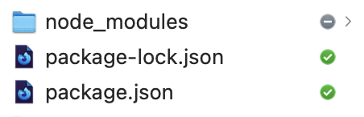

## 문제

평소에 깃헙에 소스 코드를 저장하는 방법 말고도, 드롭박스를 통해 노트북과 데스크톱의 파일을 동기화하고 있다.
최근에 문제가 발생했다. 소스 코드 용량이 채 100MB가 되지 않는데 기본 2GB의 드롭박스 용량이 부족하다는 알림이 계속 뜨는 것이다.

단순히 드롭박스 플랜을 업그레이드할까 생각을 해봤지만, 이대로 굴복할 수는 없었다…. 여러 조사 끝에 이유를 발견했다.

**패키지를 설치하고 제거하는 과정에서 `node_modules` 의 스냅샷이 드롭박스 휴지통에 계속 저장돼왔던 게 그 이유였다.** 드롭박스에선 파일을 제거해도 30일간 복구할 수 있도록 내부 휴지통에 저장하게 되는데, 이 용량도 2GB의 용량에 포함된다.

## 해결법

해결법은 생각보다 간단했다. 공식 홈페이지에서 찾을 수 있었다. 드롭박스 폴더 내부의 파일은 `com.dropbox.attrs` 이라는 속성을 가지는 듯한데, 맥 OS에서 `xattr` 라는 명령어로 파일의 확장속성을 관리할 수 있다고 한다. 파일이 확장 속성이 있는지 없는지는 `@` 표시가 붙는지 아닌지로 알 수 있다.

```zsh
$ ls -l
total 0
drwxr-xr-x@ 23 sungik-choi  staff  736 11  9 22:29 gatsby-blog
drwxr-xr-x@ 21 sungik-choi  staff  672 10 25 20:23 gatsby-starter-apple
drwxr-xr-x@  8 sungik-choi  staff  256 12  1 23:11 js-data-structure
drwxr-xr-x@ 12 sungik-choi  staff  384 11 15 17:48 learn-typescript
```

---

**결론: 터미널에 아래의 명령어를 입력하면 된다.**

```zsh
xattr -w com.dropbox.ignored 1 */node_modules
```



`node_modules` 만 동기화 목록에서 제거된 걸 확인할 수 있다. 휴지통에 `node_modules` 관련된 스냅샷도 한번에 모두 사라졌다. 용량은 2GB에서 27MB로 감소했다.

## 참고자료

- [Dropbox 파일 또는 폴더가 무시되도록 설정하는 방법](https://help.dropbox.com/ko-kr/files-folders/restore-delete/ignored-files)
- [맥(OS X)의 확장속성(xattr) 과 접근제어(ACL) 확인 및 제거](https://kiros33.tistory.com/entry/%EB%A7%A5OS-X%EC%9D%98-%ED%99%95%EC%9E%A5%EC%86%8D%EC%84%B1xattr-%EA%B3%BC-%EC%A0%91%EA%B7%BC%EC%A0%9C%EC%96%B4ACL-%ED%99%95%EC%9D%B8-%EB%B0%8F-%EC%A0%9C%EA%B1%B0)
