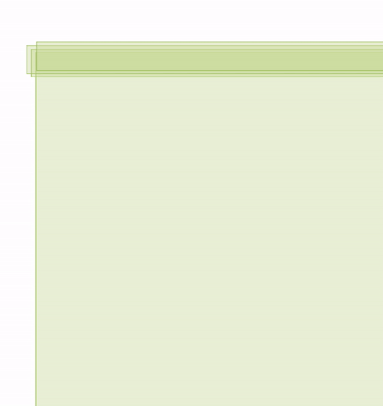
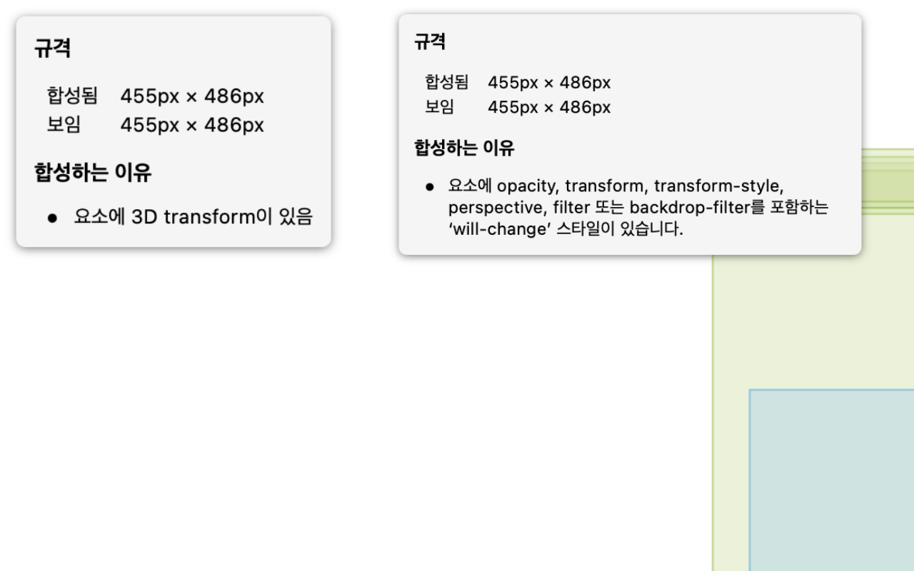
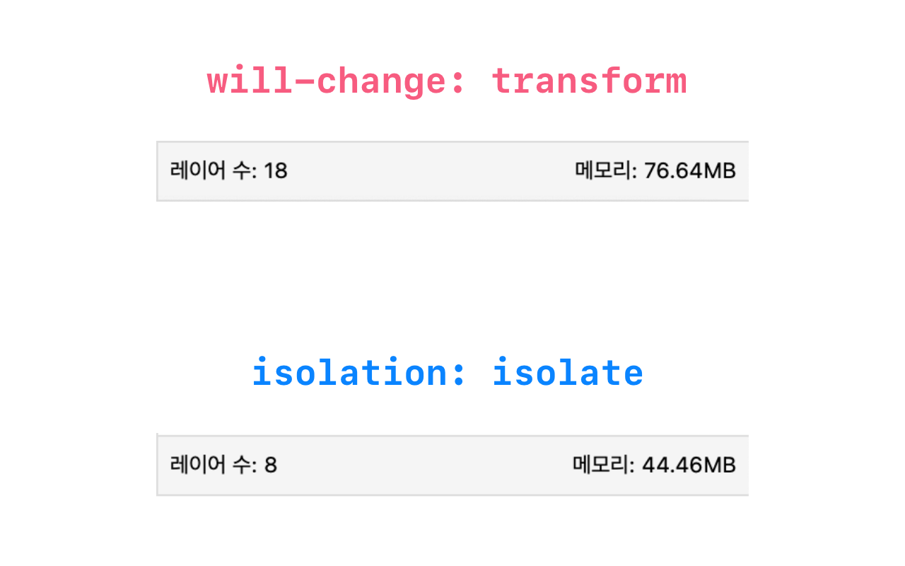

올해 블로그를 만들면서 나름대로 검수 작업(?)을 거쳤습니다. 대단할 것도 없지만, Mac의 스크린 리더인 [VoiceOver](https://www.apple.com/kr/accessibility/vision/)를 사용해서 제 사이트를 직접 '들어'보기도 하고, 키보드로만 조작이 가능한지 테스트해보기도 했습니다. (이와 관련한 부분은 따로 준비해 포스팅할 예정입니다)

크롬에서만 작업하다가 데스크톱 사파리, 아이폰으로 테스트했을 때 문제가 발생했습니다. 아래와 같은 코드(예시)였는데요.

## 문제 상황

```js
// Component
const Card = () => {
  return (
    <Wrapper>
      
    </Wrapper>
  )
}
```

```js
// Style
const Wrapper = styled.div`
  /* 생략 */
  border-radius: 10px;
  overflow: hidden;
`;

const Img = styled.img`
  /* 생략 */
`
```

블로그의 포스트 카드를 구현하는 과정에서 카드의 모서리를 둥글게 만들고 싶었습니다. `image` 를 `div` 로 감싼 후, `div` 에 `overflow:hidden` 과 `border-radius` 를 줘 스타일을 구현하려고 했습니다. `div` 에 마우스 포인터를 대면 `image` 의 `scale` 이 커지는 식의 인터랙션을 추가로 넣었습니다.

크롬에선 정상적으로 잘 작동했는데, 이상하게 **사파리**에선 그렇지 않았습니다. 호버 이벤트를 발생시켰을 때, 애니메이션 시간 동안 `border-radius` 가 제대로 동작하지 않는 것처럼 보였습니다.

<figure>
  
  <figcaption>꼭지점을 잘 봐주세요. 대체 왜 그럴까요...?</figcaption>
</figure>

## 이유

결론부터 말하면 **사파리의 렌더링 엔진 Webkit의 버그**라고 합니다.

문제 발생 초기엔 브라우저 렌더링 과정 중 '합성'에 관련된 문제인 줄 알았습니다. 레이어 패널을 확인해봤을 때, 애니메이션에 의해 레이어가 생성되는 때와 버그가 발생하는 때가 일치했기 때문입니다.

<figure>

  <figcaption>첫 번째 움짤과 비교해주세요.<br>border-radius 먹통 오류는 이렇게 레이어가 생성될 때만 일어나는 것처럼 보였습니다.</figcaption>
</figure>

**'레이어가 생성됐다 사라지는 게 아니고, 처음부터 생성된 상태라면 버그도 사라지지 않을까?'** 라는 생각에, 레이어를 강제로 생성해주기로 했습니다. `transform: translateZ(0)` 와 `will-change: transform` 스타일을 적용했을 때, 사파리 개발자 도구의 레이어 패널에서 아래와 같이 레이어가 새로 생성되는 걸 확인할 수 있었습니다. 그리고, 버그도 깔끔하게 사라졌습니다!

<figure>

  <figcaption>레이어가 생성되고, 합성된 이유를 친절하게 한글로 설명해줍니다.</figcaption>
</figure>

'🤔 정확히 어떤 이유인지는 모르겠지만 레이어가 처음부터 생성돼있었기에, `overflow: hidden` 이 같은 위계(?)에 놓이게 되고, 그래서 잘 동작하는 건가?'라고 이해하고 넘어가려는 찰나, stack overflow에서 [관련된 답변](https://stackoverflow.com/questions/49066011/overflow-hidden-with-border-radius-not-working-on-safari)을 보게 됩니다. **쌓임 맥락(stacking context)**에 관한 글이었습니다.

### 쌓임 맥락(stacking context)

MDN 문서에서 쌓임 맥락을 아래와 같이 정의하고 있습니다.

> **쌓임 맥락**(stacking context)은 가상의 Z축을 사용한 HTML 요소의 3차원 개념화입니다. Z축은 사용자 기준이며, 사용자는 뷰포트 혹은 웹페이지를 바라보고 있을 것으로 가정합니다. 각각의 HTML 요소는 자신의 속성에 따른 우선순위를 사용해 3차원 공간을 차지합니다.

그리고 쌓임 맥락을 만드는 CSS 속성들을 나열해뒀습니다.

> - 문서의 루트 요소. (`<html>`)
> - `position`이 `absolute` 또는 `relative`이고, `z-index`가 `auto`가 아닌 요소.
> - `position`이 `fixed` 또는 `sticky`인 요소. (`sticky`는 모든 모바일 브라우저에서는 해당하지만 구형 데스크톱 브라우저에서는 해당하지 않음)
> - 플렉스(`flexbox`) 컨테이너의 자식 중 `z-index`가 `auto`가 아닌 요소.
> - 그리드(`grid`) 컨테이너의 자식 중 `z-index`가 `auto`가 아닌 요소.
> - `opacity`가 `1`보다 작은 요소. (불투명도 명세 참고)
> - `mix-blend-mode`가 `normal`이 아닌 요소.
> - 다음 속성 중 하나라도 `none`이 아닌 값을 가진 요소.
>   - `transform`
>   - `filter`
>   - `perspective`
>   - `clip-path`
>   - `mask` / `mask-image` / `mask-border`
> - `isolation`이 `isolate`인 요소.
> - `-webkit-overflow-scrolling`이 `touch`인 요소.
> - `will-change`의 값으로, 초깃값이 아닐 때 새로운 쌓임 맥락을 생성하는 속성을 지정한 요소.
> - `contain`이 `layout`, `paint`, 또는 둘 중 하나를 포함하는 값(`strict`, `content` 등)인 요소.

이전엔 '`z-index` 를 통해서 엘리먼트들이 쌓이는 순서를 정할 수 있다' 정도로만 알았는데, 굉장히 많은 속성들로 쌓임 맥락을 만들어낼 수 있다는 사실을 알았습니다.

답변에서 '`overflow: hidden` 이 적용된 요소를 쌓임 맥락에 포함시키면 된다' 라고 써있었기에 `Wrapper` 에 위의 쌓임 맥락을 만드는 CSS 속성 중 하나인 `isolation: isolate` 속성을 적용해봤습니다.

```js{6}
// Style
const Wrapper = styled.div`
  /* 생략 */
  border-radius: 10px;
  overflow: hidden;
  isolation: isolate;
`;

const Img = styled.img`
  /* 생략 */
`
```

**그런데 놀랍게도 잘 작동했습니다. 레이어 패널에서 확인해봤을 때, 레이어가 생성되지 않았음에도 불구하고 말이죠!** 레이어가 생성되지 않았기 때문에, 메모리도 더 적게 차지했습니다. 확실히 답변대로 버그의 원인은 레이어의 생성 여부가 아니라, **쌓임 맥락**에 관련된 것이란 사실을 알게 됐습니다.

<figure>

  <figcaption>제 블로그 포스트가 현재 10개이기에(...) 10개의 레이어가 사라졌습니다.</figcaption>
</figure>

아래는 stack overflow 답변의 전문입니다. 총정리라고도 볼 수 있겠네요.

> **This is caused by an one of several unresolved bugs in WebKit, the rendering engine used by Safari**:
>
> -> 사파리의 렌더링 엔진 Webkit의 버그다...
>
> - [Border-radius clip of non-stacking composited descendant doesn't work](https://bugs.webkit.org/show_bug.cgi?id=140535)
> - [overflow: hidden + border radius does not work when transform is added to child](https://bugs.webkit.org/show_bug.cgi?id=98538)
>
> As Simon Fraser writes in the second link:
>
> > **You can work around it in recent builds by making the element with overflow:hidden into a stacking context (e.g. position:relative, z-index:0).**
>
> -> 버그를 해결하기 위해선 `overflow: hidden` 을 사용한 엘리먼트를 쌓임 맥락(stacking context)에 포함시키면 된다.
>
> **This is probably the simplest solution since, unlike some of the other answers here, it does not unnecessarily introduce render layers.**
>
> -> 이 방법은 렌더링 계층을 불필요하게 도입하지 않기 때문에 가장 간단한 솔루션이다.

## 해결법

`overflow: hidden` 스타일을 적용할 엘리먼트를 쌓임 맥락에 포함시키면 됩니다.

`position` 이 `absolute` 나 `relative` 일 경우 `z-index`

```css
z-index: 0
```

그 외의 경우엔

```css
isolation: isolate
```

`isolation` 으로 쌓임 맥락을 생성해주는 방법이 가장 좋아 보이지만, 상황에 따라 가장 적절한 방법을 취사선택 해야겠습니다.

### 주의할 점

아무래도 버그라서 그런지, MDN 문서에서 제시하고 있는 '쌓임 맥락에 포함시키는 방법' 중에서도 먹히지 않는 방법이 있었습니다. 저의 경우 아래 방법들은 원하는 대로 동작하지 않았습니다. 꼭 직접 체크해보세요!

- `--webkit-overflow-scrolling: touch`
- `contain: paint` or `contain: layout`

## 참고자료

- [MDN 쌓임 맥락(Stacking Context)](https://developer.mozilla.org/ko/docs/Web/CSS/CSS_Positioning/Understanding_z_index/The_stacking_context)
- [stack overflow: overflow hidden with border radius not working on safari](https://stackoverflow.com/questions/49066011/overflow-hidden-with-border-radius-not-working-on-safari)
